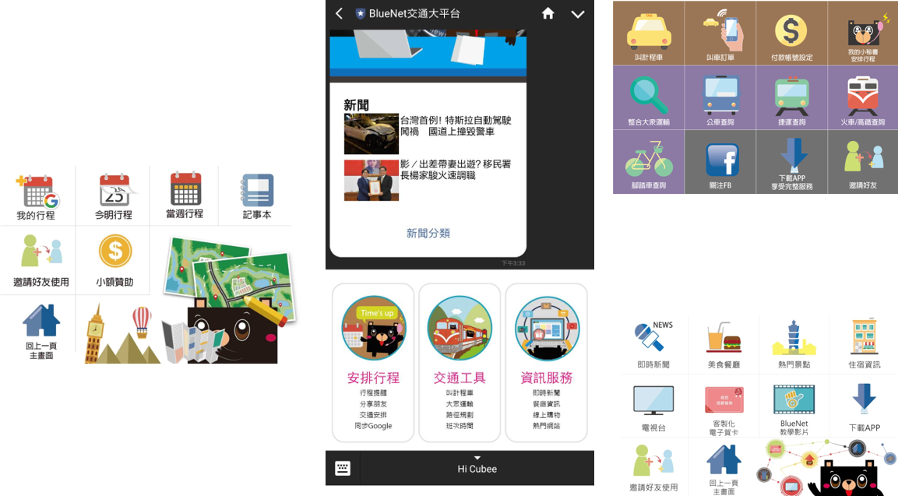
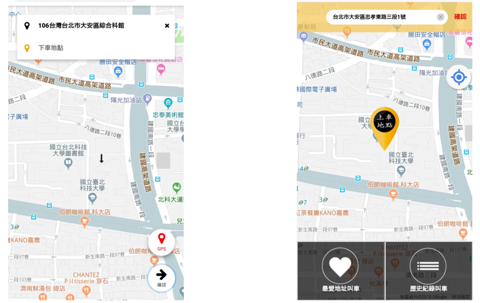
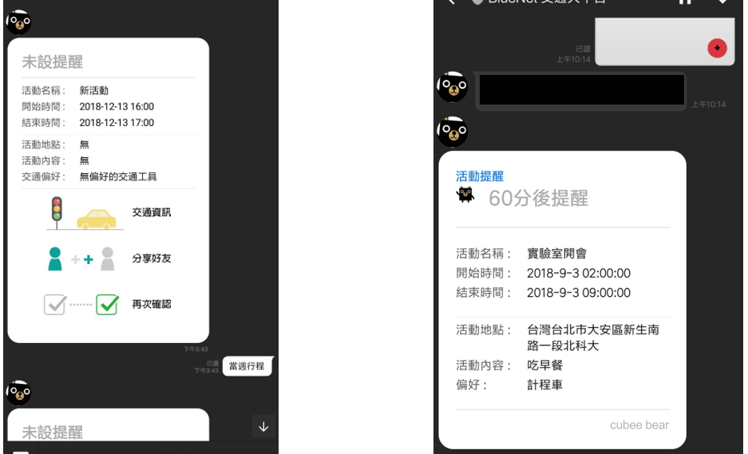
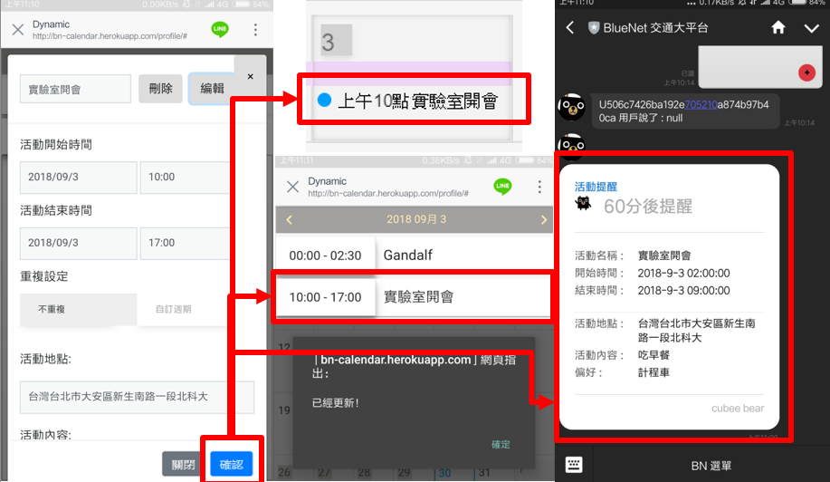
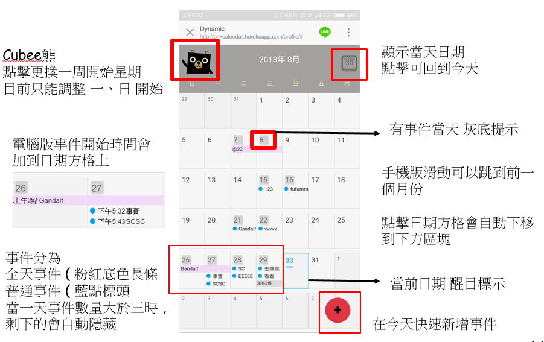

# 大學實驗室參與的計畫內容

這個專案為實驗室原本科技部計畫(BlueNet 交通大平台)的延伸, 在原先叫車服務( web 端, ios 端, andriod 端 ), 額外擴展在社群軟體上, 因為考量到使用 LINE 的人相當多以及 LINE 所提供給開發者的服務也非常多元, 可以在日常生活中很好的做銜接, 讓自己的服務可以很快的與使用者接觸到, 也能減少使用者安裝 APP 的動作, 而且所有的介面及一些底層網路安全協定, 這些社群軟體商都幫你訂好了, 做為一個前端介面能省去很多麻煩, 比較可以專注在自己的服務上

---

 
 

此專案為以 node.js 作為 Line chatbot 的基礎, 在 LINE 官方帳號上, 我們使用 LINE 提供的 Rich Menu 來定義版面, 根據需求配置功能區塊, 根據不同使用者情況下方的選單內容也會動態的改變, 在使用前需要使用者的 Line UserId 與電話號碼電子郵件做綁定, 有了 UserId 才有辦法做進一步的服務

---

 
 

使用者需要叫車時(及時叫車與預約叫車), 我們以網頁跟後端叫車服務系統做串接, 以 Google Map API 調整地圖風格及搜尋框自動填入的預備選項, 調整到指定地區範圍, 取得使用者授權與表格資料後, 發送當前 GPS 位置與使用者填入的特殊條件, 傳回後台進行司機搶單

---

 
 

後端服務接到正確格式後, 根據收到的使用者 UserId 在聊天室內做提醒動作, 並在時間快到時(預約叫車)主動以 LINE 進行通知, 或是根據使用者需要在聊天室顯示

---

 
 

為了更好的使用者體驗, 我們增加了以 google calendar api 為主的秘書服務, 取得用戶同意後, 把使用者行事曆與叫車服務做連結, 預約叫完車後自動新增進 google 日曆中, 根據交通方式偏好提供直接的連結服務

